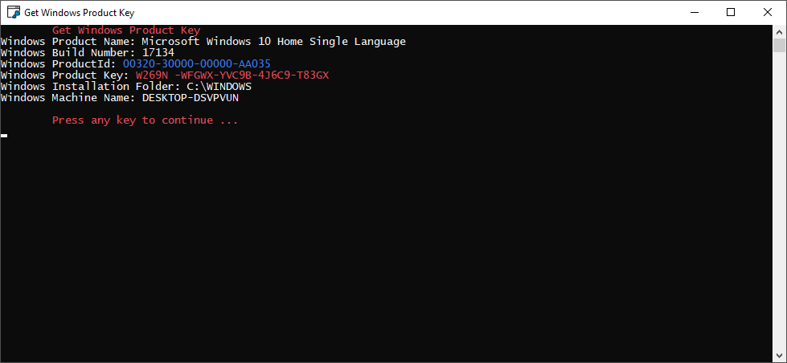

# Get-Windows-Product-Key

### Apresentação
Obtenha a chave do produto Windows. Este aplicativo é escrito em C# e destina-se a todos que precisam obter o número da chave do produto Windows ou 
para aqueles que desejam decodificar `DigitalProductId` exportado do registro.

Registry Address: `HKEY_LOCAL_MACHINE\SOFTWARE\Microsoft\Windows NT\CurrentVersion\DigitalProductId`

Observação: Eu não sou responsável por nada que você faça com isso. Isso é apenas para propósitos educacionais.

## Referências :notebook:
- Foi utilizada a Class `KeyDecoder` do projeto. [WinProdKeyFinder](https://github.com/mrpeardotnet/WinProdKeyFinder)

## Author
[Guilherme Lima](https://github.com/guilhermelim)

## License
[MIT License](https://raw.githubusercontent.com/guilhermelim/Get-Windows-Product-Key/master/LICENSE)